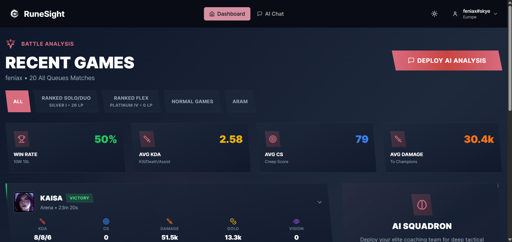
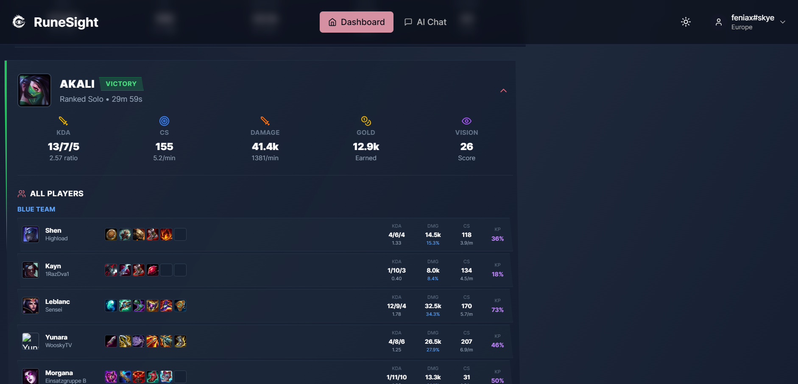
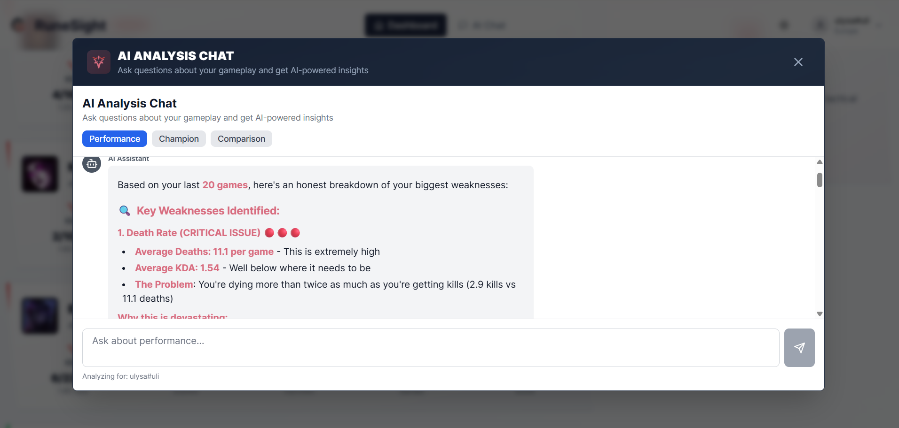

# RuneSight 🎮⚔️

> AI-powered League of Legends analytics platform using Strands agents and Amazon Bedrock

[](https://aws.amazon.com/amplify/)
[](https://www.python.org/)
[](https://reactjs.org/)
[](https://fastapi.tiangolo.com/)

**Legal Disclaimer:** RuneSight is not endorsed by Riot Games and does not reflect the views or opinions of Riot Games or anyone officially involved in producing or managing Riot Games properties. Riot Games and all associated properties are trademarks or registered trademarks of Riot Games, Inc.

---

## 📸 Screenshots

### Homepage

*Clean, gaming-inspired landing page with dark mode support*

### Dashboard

*Real-time match analytics with performance metrics*

### Match Analysis

*Detailed match breakdown with KDA, CS, and damage statistics*

### AI-Powered Insights

*Personalized improvement recommendations from AI agents*

---

## 🚀 Features

### 🤖 Multi-Agent AI System
- **Performance Analysis Agent** - Individual match performance and improvement areas
- **Comparison Agent** - Friend performance analysis and benchmarking
- **Champion Expert Agent** - Champion-specific advice, builds, and matchup analysis
- **Team Synergy Agent** - Team composition and player synergy evaluation
- **Match Summary Agent** - Comprehensive match summaries and retrospectives

### ⚡ Performance Optimizations
- **Progressive Loading** - Dashboard loads in 1-2 seconds with background data fetching
- **Smart Caching** - 80%+ cache hit rate reduces API calls by 50%
- **Instant Tab Switching** - Pre-fetched data for all queue types
- **Rate Limiting** - Intelligent Riot API call management

### 🎨 Modern UI/UX
- **Dark/Light Mode** - Full theme support with proper contrast
- **Responsive Design** - Works seamlessly on desktop and mobile
- **Gaming Aesthetic** - League of Legends inspired design
- **Real-time Updates** - Live match data and statistics

### 🔒 Security & Reliability
- **Error Boundaries** - Graceful error handling and recovery
- **CORS Configuration** - Proper cross-origin resource sharing
- **Retry Logic** - Automatic retry with exponential backoff
- **Loading States** - Clear feedback for all operations

---

## 🏗️ Architecture

```
┌─────────────────────────────────────────────────────────────┐
│                     AWS Amplify (Frontend)                   │
│                  React + TypeScript + Vite                   │
└────────────────────────┬────────────────────────────────────┘
                         │
                         │ HTTPS/REST
                         │
┌────────────────────────▼────────────────────────────────────┐
│                  AWS Lambda (Backend)                        │
│              FastAPI + Python 3.9 + Mangum                   │
└────────┬───────────────────────────────────┬────────────────┘
         │                                   │
         │ Riot API                          │ Bedrock API
         │                                   │
┌────────▼────────────┐           ┌─────────▼──────────────┐
│   Riot Games API    │           │   Amazon Bedrock       │
│   + Data Dragon     │           │   (Claude Sonnet)      │
└─────────────────────┘           └────────────────────────┘
```

### Tech Stack

**Frontend:**
- React 18 + TypeScript
- Vite (build tool)
- Tailwind CSS + shadcn/ui
- React Query (data fetching)
- Framer Motion (animations)

**Backend:**
- FastAPI (Python web framework)
- Mangum (Lambda adapter)
- Strands Agents (AI orchestration)
- Amazon Bedrock (AI models)
- Boto3 (AWS SDK)

**Deployment:**
- AWS Amplify (frontend hosting)
- AWS Lambda (backend compute)
- AWS Lambda Function URL (API endpoint)
- CloudWatch (logging & monitoring)

---

## 📁 Project Structure

```
RuneSight/
├── frontend/                    # React application
│   ├── src/
│   │   ├── components/         # UI components
│   │   │   ├── ui/            # shadcn/ui components
│   │   │   ├── dashboard/     # Dashboard components
│   │   │   ├── chat/          # Chat interface
│   │   │   └── layout/        # Layout components
│   │   ├── hooks/             # Custom React hooks
│   │   ├── lib/               # Utilities & API client
│   │   └── types/             # TypeScript types
│   └── package.json
│
├── backend/                     # FastAPI application
│   ├── agents/                 # Strands AI agents
│   │   ├── base_agent.py      # Bedrock config (IAM role + credentials)
│   │   ├── performance_agent.py
│   │   ├── champion_agent.py
│   │   └── comparison_agent.py
│   ├── api/                    # API route handlers
│   │   ├── riot.py            # Riot API endpoints
│   │   └── analysis.py        # Analysis endpoints
│   ├── services/               # Business logic
│   │   ├── riot_api_client.py # Riot API client
│   │   ├── cache_service.py   # Caching service
│   │   └── data_processor.py  # Data processing
│   ├── models/                 # Pydantic models
│   ├── main.py                 # FastAPI app
│   ├── lambda_handler.py       # Lambda entry point
│   └── requirements.txt
│
├── deployment/                  # Deployment scripts & docs
│   ├── deploy-backend.ps1      # Backend deployment (Docker + Lambda)
│   ├── deploy-frontend.ps1     # Frontend deployment (Amplify)
│   ├── backend.config.json     # Backend config (gitignored)
│   ├── frontend.config.json    # Frontend config (gitignored)
│   ├── *.example.json          # Config templates
│   ├── SETUP-README.md         # Complete deployment guide
│   └── README.md               # Quick overview
│
├── images/                      # Screenshots
└── README.md                    # This file
```

---

## 🚀 Quick Start

### Prerequisites

- **Python 3.11+** with pip
- **Node.js 18+** with npm
- **AWS CLI 2.4+** configured
- **Docker Desktop** (for Lambda deployment)
- **PowerShell** (not cmd)
- **Riot Games API key** ([Get one here](https://developer.riotgames.com/))
- **AWS account** with Bedrock and Lambda access

### Local Development

#### 1. Backend Setup

```powershell
# Navigate to backend
cd backend

# Create virtual environment
python -m venv venv
.\venv\Scripts\Activate.ps1  # Windows PowerShell
# source venv/bin/activate    # Linux/Mac

# Install dependencies
pip install -r requirements.txt

# Configure environment
cp .env.example .env
# Edit .env with your API keys and AWS credentials

# Run development server
python main.py
```

Backend will be available at `http://localhost:8000`

**Note:** For local development, you need AWS credentials in `.env`. In production (Lambda), IAM roles are used automatically.

#### 2. Frontend Setup

```powershell
# Navigate to frontend
cd frontend

# Install dependencies
npm install

# Configure environment
# Create .env with VITE_API_URL pointing to your backend

# Run development server
npm run dev
```

Frontend will be available at `http://localhost:5173`

---

## 🌐 Deployment

### Quick Deploy to AWS

**Important:** Use PowerShell (not cmd) and ensure Docker Desktop is running!

```powershell
# 1. Activate virtual environment
cd backend
.\venv\Scripts\Activate.ps1

# 2. Deploy backend with Docker (Linux-compatible dependencies)
cd ..\deployment
.\deploy-backend.ps1 -UseDocker -SkipLayer -CleanBuild

# 3. Copy the Lambda Function URL from output

# 4. Update frontend config with Lambda URL
# Edit frontend.config.json with your Lambda URL

# 5. Deploy frontend
.\deploy-frontend.ps1

# 6. Update backend CORS with Amplify URL
# Edit backend.config.json and add Amplify URL to ALLOWED_ORIGINS
.\deploy-backend.ps1 -UpdateEnvOnly
```

### Deployment Features

- ✅ **Docker-based builds** - Linux-compatible dependencies for Lambda
- ✅ **No Lambda layers needed** - All dependencies in function package
- ✅ **IAM role authentication** - Automatic in production, credentials for local
- ✅ **Fast updates** - `-UpdateEnvOnly` for environment variable changes
- ✅ **CORS configuration** - Automatic setup for Amplify integration

### Detailed Deployment Guide

See **[deployment/SETUP-README.md](deployment/SETUP-README.md)** for complete deployment instructions, troubleshooting, and configuration details.

---

## 🔧 Configuration

### Backend Environment Variables

**For Local Development (.env file):**
```bash
# Riot Games API
RIOT_API_KEY=your_riot_api_key

# AWS Credentials (local development only)
AWS_ACCESS_KEY_ID=your_access_key
AWS_SECRET_ACCESS_KEY=your_secret_key

# AWS Bedrock
BEDROCK_REGION=eu-central-1
BEDROCK_MODEL_ID=your_bedrock_model_arn

# CORS Configuration
ALLOWED_ORIGINS=http://localhost:5173

# Application
ENVIRONMENT=development
PORT=8000
LOG_LEVEL=INFO
```

**For Production (Lambda - backend.config.json):**
```json
{
  "environment": {
    "RIOT_API_KEY": "your_riot_api_key",
    "BEDROCK_REGION": "eu-central-1",
    "BEDROCK_MODEL_ID": "your_bedrock_model_arn",
    "ALLOWED_ORIGINS": "https://your-amplify-domain.amplifyapp.com",
    "ENVIRONMENT": "production",
    "LOG_LEVEL": "INFO"
  }
}
```

**Note:** AWS credentials are NOT needed in Lambda - IAM roles are used automatically.

### Frontend Environment Variables

```bash
# API Endpoint
VITE_API_URL=https://your-lambda-url.lambda-url.region.on.aws

# Optional: Analytics
VITE_ANALYTICS_ID=your_analytics_id
```

---

## 📊 API Endpoints

### Health & Status

- `GET /` - Root health check
- `GET /api/health` - Detailed health status
- `GET /api/riot/cache/stats` - Cache statistics

### Riot API Integration

- `POST /api/riot/validate` - Validate RiotID
- `GET /api/riot/matches/{riotId}` - Get match history
- `GET /api/riot/match/{matchId}` - Get match details
- `GET /api/riot/ranked/{riotId}` - Get ranked information

### AI Analysis

- `POST /api/analysis/performance` - Performance analysis
- `POST /api/analysis/champion` - Champion advice
- `POST /api/analysis/compare` - Player comparison

---

## 🧪 Testing

### Backend Tests

```powershell
cd backend
pytest
```

### Frontend Tests

```powershell
cd frontend
npm test
```

### Cache Service Test

```powershell
cd backend
python test_cache.py
```

---

## 📈 Performance Metrics

### Backend Performance

- **Cache Hit Rate**: 80%+
- **API Call Reduction**: 50%+
- **Response Time (cached)**: < 10ms
- **Response Time (uncached)**: 200-500ms

### Frontend Performance

- **Time to First Content**: 1-2 seconds
- **Tab Switch Time**: Instant (0ms)
- **Progressive Loading**: Background data fetching
- **Cache Strategy**: 5-minute TTL with localStorage

---

## 🛠️ Development

### Code Quality

**Backend:**
```powershell
# Format code
black .

# Lint
flake8 .

# Type checking
mypy .
```

**Frontend:**
```powershell
# Lint
npm run lint

# Format
npm run format

# Type check
npm run type-check
```

### Git Workflow

```bash
# Create feature branch
git checkout -b feature/your-feature

# Make changes and commit
git add .
git commit -m "feat: your feature description"

# Push and create PR
git push origin feature/your-feature
```

---

## 🐛 Troubleshooting

### CORS Errors

See [deployment/01-backend-deployment-guide.md](deployment/01-backend-deployment-guide.md#cors-configuration)

**Quick fix:**
1. Verify Lambda Function URL CORS is disabled
2. Check `ALLOWED_ORIGINS` environment variable
3. Redeploy backend

### Import Errors

Ensure all dependencies are installed:
```powershell
pip install -r requirements.txt
```

### Rate Limiting

The backend implements automatic rate limiting:
- 1.2s delay between Riot API requests
- Exponential backoff on errors
- Cache-first approach

---

## 📚 Documentation

- **[Complete Deployment Guide](deployment/SETUP-README.md)** - Full deployment instructions with troubleshooting
- **[Quick Deployment Overview](deployment/README.md)** - Fast reference guide
- **[API Documentation](http://localhost:8000/docs)** - Interactive API docs (when running locally)
- **[CloudWatch Logs](https://console.aws.amazon.com/cloudwatch/)** - Production logs and monitoring

---

## 🤝 Contributing

This is a hackathon project. Contributions are welcome!

1. Fork the repository
2. Create a feature branch
3. Make your changes
4. Submit a pull request

---

## 📄 License

MIT License - See [LICENSE](LICENSE) file for details

---

## 🙏 Acknowledgments

- **Riot Games** - For the League of Legends API and Data Dragon
- **AWS** - For Amplify, Lambda, and Bedrock services
- **Strands** - For the AI agents framework
- **shadcn/ui** - For the beautiful UI components
- **Anthropic** - For Claude AI models via Bedrock

---

## 📞 Support

For issues or questions:
1. Check [deployment documentation](deployment/)
2. Review CloudWatch Logs
3. Open an issue on GitHub

---

## 🎯 Roadmap

- [ ] WebSocket support for real-time updates
- [ ] Advanced champion statistics
- [ ] Team composition analyzer
- [ ] Match prediction system
- [ ] Mobile app (React Native)
- [ ] Discord bot integration

---

**Built with ❤️ for the League of Legends community**

*RuneSight - See beyond the Rift*
